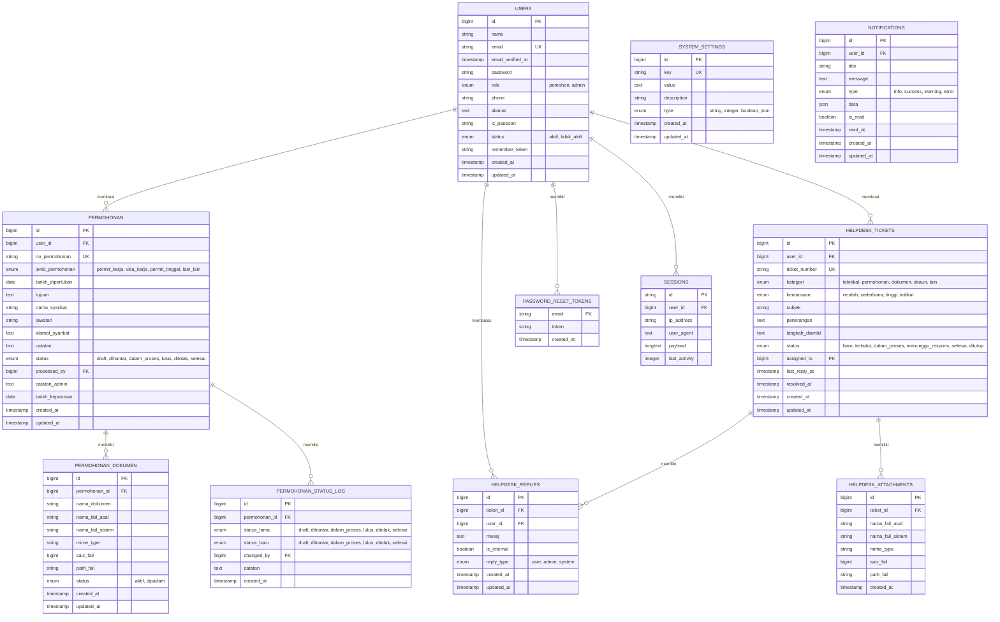

# ERD Sistem Permohonan JDN

## 1. Gambaran Umum

Entity Relationship Diagram (ERD) untuk Sistem Permohonan Jabatan Daftar Negara (JDN) yang mengelola permohonan permit kerja, visa kerja, permit tinggal, dan sistem helpdesk untuk support pengguna.

## 2. Diagram ERD

## 3. Deskripsi Entitas

### 3.1 USERS

Menyimpan data pengguna sistem (pemohon dan admin)

* **Role**: pemohon (pengguna biasa), admin (administrator sistem)

* **Status**: aktif (dapat menggunakan sistem), tidak\_aktif (diblokir)

### 3.2 PERMOHONAN

Menyimpan data permohonan yang diajukan oleh pemohon

* **Jenis Permohonan**: permit\_kerja, visa\_kerja, permit\_tinggal, lain\_lain

* **Status**: draft (belum dihantar), dihantar (sudah disubmit), dalam\_proses (sedang diproses admin), lulus (disetujui), ditolak (tidak disetujui), selesai (proses selesai)

* **No Permohonan**: nomor unik yang digenerate otomatis

### 3.3 PERMOHONAN\_DOKUMEN

Menyimpan file dokumen pendukung permohonan

* Mendukung multiple file upload per permohonan

* Menyimpan metadata file (nama asli, nama sistem, ukuran, path)

### 3.4 PERMOHONAN\_STATUS\_LOG

Menyimpan riwayat perubahan status permohonan untuk audit trail

* Mencatat siapa yang mengubah status dan kapan

* Menyimpan catatan alasan perubahan status

### 3.5 HELPDESK\_TICKETS

Menyimpan tiket support dari pengguna

* **Kategori**: teknikal, permohonan, dokumen, akaun, lain

* **Keutamaan**: rendah, sederhana, tinggi, kritikal

* **Status**: baru, terbuka, dalam\_proses, menunggu\_respons, selesai, ditutup

### 3.6 HELPDESK\_REPLIES

Menyimpan balasan/komunikasi dalam tiket helpdesk

* **Reply Type**: user (dari pengguna), admin (dari admin), system (otomatis)

* **Is Internal**: untuk catatan internal admin yang tidak terlihat user

### 3.7 HELPDESK\_ATTACHMENTS

Menyimpan file lampiran dalam tiket helpdesk

* Mendukung multiple file attachment per tiket

### 3.8 NOTIFICATIONS

Sistem notifikasi untuk pengguna

* **Type**: info, success, warning, error

* **Data**: JSON field untuk data tambahan notifikasi

### 3.9 SYSTEM\_SETTINGS

Konfigurasi sistem yang dapat diubah melalui admin panel

* **Type**: string, integer, boolean, json untuk validasi tipe data

## 4. Relasi Utama

### 4.1 User ke Permohonan (1:N)

* Satu user dapat membuat banyak permohonan

* Setiap permohonan dimiliki oleh satu user

### 4.2 User ke Helpdesk Tickets (1:N)

* Satu user dapat membuat banyak tiket helpdesk

* Admin dapat di-assign ke banyak tiket

### 4.3 Permohonan ke Dokumen (1:N)

* Satu permohonan dapat memiliki banyak dokumen pendukung

* Setiap dokumen terkait dengan satu permohonan

### 4.4 Helpdesk Tickets ke Replies (1:N)

* Satu tiket dapat memiliki banyak balasan

* Setiap balasan terkait dengan satu tiket

### 4.5 Permohonan ke Status Log (1:N)

* Satu permohonan memiliki banyak log perubahan status

* Setiap log terkait dengan satu permohonan

## 5. Indeks dan Constraint

### 5.1 Primary Keys

* Semua tabel menggunakan `id` sebagai primary key dengan tipe `bigint`

* Tabel `password_reset_tokens` menggunakan `email` sebagai primary key

* Tabel `sessions` menggunakan `id` string sebagai primary key

### 5.2 Unique Constraints

* `users.email` - email harus unik

* `permohonan.no_permohonan` - nomor permohonan harus unik

* `helpdesk_tickets.ticket_number` - nomor tiket harus unik

* `system_settings.key` - key setting harus unik

### 5.3 Foreign Key Constraints

* `permohonan.user_id` → `users.id`

* `permohonan.processed_by` → `users.id`

* `permohonan_dokumen.permohonan_id` → `permohonan.id`

* `permohonan_status_log.permohonan_id` → `permohonan.id`

* `permohonan_status_log.changed_by` → `users.id`

* `helpdesk_tickets.user_id` → `users.id`

* `helpdesk_tickets.assigned_to` → `users.id`

* `helpdesk_replies.ticket_id` → `helpdesk_tickets.id`

* `helpdesk_replies.user_id` → `users.id`

* `helpdesk_attachments.ticket_id` → `helpdesk_tickets.id`

* `sessions.user_id` → `users.id`

* `notifications.user_id` → `users.id`

### 5.4 Indeks untuk Performance

* `permohonan.status` - untuk filter berdasarkan status

* `permohonan.jenis_permohonan` - untuk filter berdasarkan jenis

* `permohonan.created_at` - untuk sorting berdasarkan tanggal

* `helpdesk_tickets.status` - untuk filter berdasarkan status tiket

* `helpdesk_tickets.kategori` - untuk filter berdasarkan kategori

* `helpdesk_tickets.keutamaan` - untuk filter berdasarkan prioritas

* `notifications.user_id, is_read` - untuk notifikasi pengguna

* `sessions.last_activity` - untuk cleanup session

## 6. Catatan Implementasi

### 6.1 Soft Delete

* Tabel `permohonan` dan `helpdesk_tickets` sebaiknya menggunakan soft delete

* Tambahkan kolom `deleted_at` untuk audit trail

### 6.2 File Storage

* File dokumen dan attachment disimpan di storage Laravel

* Path file disimpan relatif terhadap storage directory

* Implementasikan file cleanup untuk file yang tidak terpakai

### 6.3 Security

* Password di-hash menggunakan bcrypt

* File upload harus divalidasi tipe dan ukurannya

* Implementasikan rate limiting untuk API endpoints

### 6.4 Performance

* Gunakan eager loading untuk relasi yang sering diakses

* Implementasikan caching untuk data yang jarang berubah

* Pertimbangkan pagination untuk list data yang besar

### 6.5 Audit Trail

* Semua perubahan penting harus dicatat di log

* Gunakan Laravel's model events untuk otomatis logging

* Simpan IP address dan user agent untuk security audit

